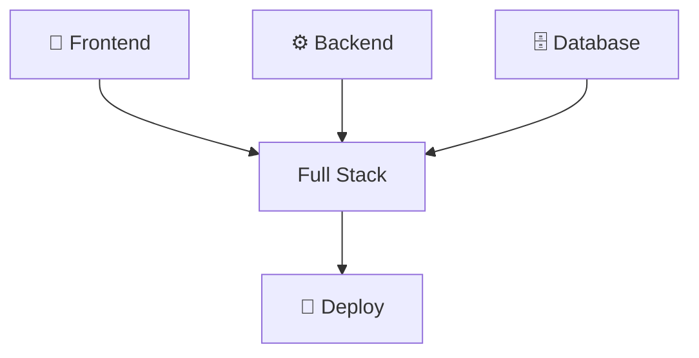
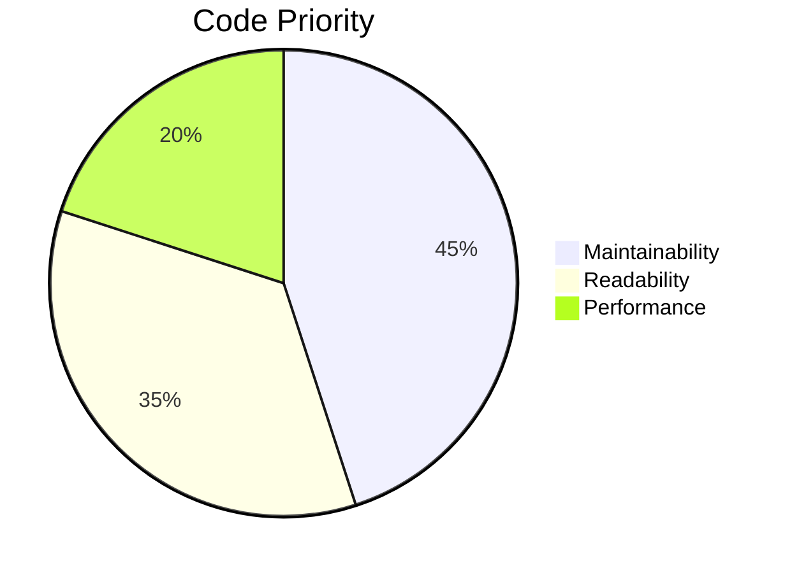
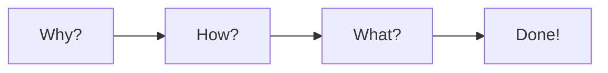
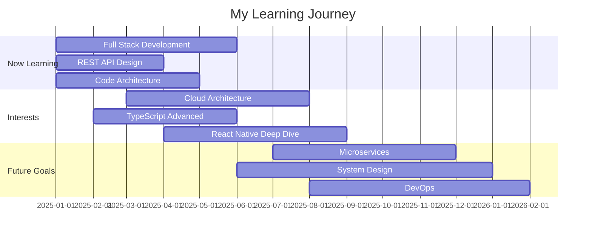

<!-- Header with gradient background -->

  

 

### 💭 *사용자 경험 · 서버 안정성 · 구조 설계를 동시에 고민합니다*

 

 

<!-- Profile Section with Cards -->

## 💫 Developer DNA

<table align="center">
<tr>
<td width="33%" align="center">

**Data Flow Master**

전체 시스템을 이해하는  
풀스택 개발자

</td>
<td width="33%" align="center">

**Structure First**

유지보수 가능한 구조가  
최우선 목표

</td>
<td width="33%" align="center">

**Explainable Code**

구현 이유를 설명할 수  
있는 주니어

</td>
</tr>
</table>

 
 

<!-- Tech Stack Section -->

## 🛠️ Tech Arsenal

### Frontend Weapons

### Backend Fortress

### Data & Cloud Kingdom

### Developer Toolbox

### 📚 Currently Exploring

 
 

<!-- Projects Section -->

## 🎯 Project Showcase

### 🎨 Frontend Adventures

<table>
<tr>
<td width="50%">

#### 🌐 User-Centric Web Platform
> *React + TypeScript SPA Architecture*

**🎯 Key Features**
- 🧩 Component-based UI for maximum reusability
- 📱 Responsive layout with Tailwind CSS
- 🔄 Efficient state management & API integration
- ⚡ Performance optimization for better UX
- 🗺️ SPA navigation with React Router
- 🌐 Global state with Redux/Context API
- 📦 Code splitting & lazy loading

**Tech Stack**  

</td>
<td width="50%">

#### 📱 Cross-Platform Mobile App
> *React Native Universal Solution*

**🎯 Key Features**
- 🍎 iOS & Android simultaneous support
- 🎨 Optimized UX with intuitive UI/UX
- ⚡ Native module integration
- 📐 Responsive design for all devices
- 💾 Local data with AsyncStorage
- 🔔 Push notifications & location services
- ✨ Natural UX with gestures & animations

**Tech Stack**  

</td>
</tr>
</table>

### ⚙️ Backend Engineering

<table>
<tr>
<td width="50%">

#### 🔧 Enterprise REST API Server
> *Spring Boot Microservice Architecture*

**🎯 Key Features**
- 🏗️ RESTful API design & implementation
- 🗄️ Stable data management with MySQL & MyBatis
- 🎯 Layered architecture with exception handling
- 🔐 JWT authentication & security
- 🛡️ Authorization with Spring Security
- 📝 Automated API docs with Swagger
- 💼 Transaction management & data integrity

**Tech Stack**  

</td>
<td width="50%">

#### 💬 Real-time Communication Service
> *WebSocket Bidirectional System*

**🎯 Key Features**
- 🚀 Lightweight high-performance server with Node.js
- 🔄 Real-time bidirectional data transmission
- 🎭 Event-driven architecture
- 👥 Multi-client concurrent handling
- 💬 Real-time chat with Socket.io
- ⚡ Session & caching with Redis
- 🏠 Room-based group communication

**Tech Stack**  

</td>
</tr>
</table>

 

<!-- Infrastructure Section -->

## ☁️ Infrastructure & DevOps

<table>
<tr>
<td align="center" width="33%">
 
<b>☁️ Cloud Platform</b> 
AWS / Naver Cloud 서버 구성 및 운영
</td>
<td align="center" width="34%">
 
<b>📦 Containerization</b> 
Docker 기반 환경 분리 및 관리
</td>
<td align="center" width="33%">
<b>🔄 CI/CD</b>  
지속적 통합/배포 파이프라인 구축
</td>
</tr>
</table>

 
 

<!-- Roadmap Section -->

## 🗺️ Development Roadmap

 

<b>🎯 Click to see detailed focus areas</b>

 

<table width="100%">
<tr>
<th width="33%" align="center">
 Now Learning
</th>
<th width="34%" align="center">
 Interest
</th>
<th width="33%" align="center">
 Future Goals
</th>
</tr>
<tr>
<td valign="top">

- 🎨 **Full Stack 서비스 구현**
  - 프론트엔드부터 백엔드까지 통합 개발
  
- 🔌 **REST API 설계**
  - 확장 가능한 API 아키텍처 구축
  
- 🏗️ **구조 개선**
  - 클린 코드와 디자인 패턴 적용

</td>
<td valign="top">

- ☁️ **Cloud Architecture**
  - 클라우드 네이티브 애플리케이션 설계
  
- 📘 **TypeScript Advanced**
  - 고급 타입 시스템 활용
  
- 📱 **React Native Deep Dive**
  - 크로스 플랫폼 앱 최적화

</td>
<td valign="top">

- 🔄 **Microservices**
  - MSA 아키텍처 설계 및 구현
  
- 🎯 **System Design**
  - 대규모 시스템 설계 능력 향상
  
- 🚀 **DevOps**
  - 자동화된 배포 및 모니터링 구축

</td>
</tr>
</table>

 
 

<!-- GitHub Stats -->

## 📊 GitHub Analytics

 
 

<!-- Contact Section -->

## 📬 Let's Connect!

 

### *"Code is like humor. When you have to explain it, it's bad."*
– Cory House

 

