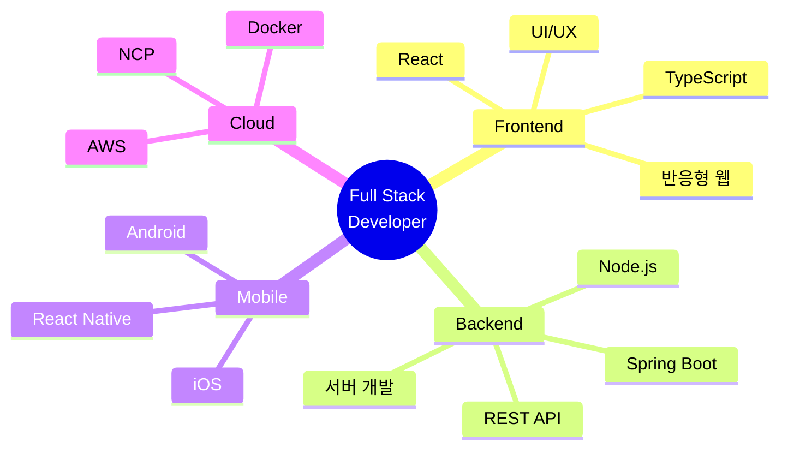

<div align="center">


<br>

### 🚀 안녕하세요! 끊임없이 성장하는 개발자 서재민입니다

```typescript
class Developer {
    name = "서재민 (Seo Jae Min)";
    location = "Seoul, South Korea 🇰🇰";
    role = "Full Stack Developer";
    
    getSkills() {
        return {
            frontend: ["React", "TypeScript", "React Native", "Tailwind CSS"],
            backend: ["Spring Boot", "Node.js", "MyBatis", "REST API"],
            database: ["MySQL"],
            cloud: ["AWS", "Naver Cloud Platform"],
            mobile: ["React Native", "iOS", "Android"],
            design: ["Figma", "UI/UX Design"]
        };
    }
    
    getMotto() {
        return "사용자 중심의 사고와 안정적인 기술 구현으로 가치있는 서비스를 만듭니다 ✨";
    }
}
```

<br>

[](https://git.io/typing-svg)

<br>

</div>

---

<br>

<div align="center">

## 🎨 TECH STACK

</div>

<div align="center">

### Frontend Development
<br>


<br>

### Backend Development
<br>


<br>

### API & Communication
<br>


<br>

### Database & Cloud
<br>


<br>

### Mobile & Design
<br>


<br>

### Tools & Collaboration
<br>


</div>

<br>

---

<br>

<div align="center">

## 💪 EXPERTISE

</div>

<br>

<table align="center">
<tr>
<td width="50%" align="center" valign="top">

### 🌐 풀스택 개발

프론트엔드부터 백엔드까지  
전체 웹 서비스를 구축합니다

**Frontend**  
React · TypeScript · Tailwind CSS

**Backend**  
Spring Boot · Node.js · REST API

**Database**  
MySQL · MyBatis

</td>

<td width="50%" align="center" valign="top">

### 📱 모바일 & 반응형

다양한 플랫폼에서  
최적의 사용자 경험을 제공합니다

**Mobile**  
React Native · iOS · Android

**Responsive**  
Mobile-First Design  
Cross-Platform Support

**Design**  
Figma · UI/UX

</td>
</tr>

<tr>
<td width="50%" align="center" valign="top">

### ☁️ 클라우드 & 인프라

안정적이고 확장 가능한  
서비스 환경을 구축합니다

**Cloud Platform**  
AWS · Naver Cloud Platform

**DevOps**  
Docker · CI/CD

**Infrastructure**  
서버 구축 및 배포 관리

</td>

<td width="50%" align="center" valign="top">

### 🎯 문제 해결 능력

효율적인 솔루션으로  
비즈니스 가치를 창출합니다

**Architecture**  
시스템 설계 · API 설계

**Optimization**  
성능 최적화 · 코드 리팩토링

**Collaboration**  
Git · Jira · 애자일 방법론

</td>
</tr>
</table>

<br>

---

<br>

<div align="center">

## 📈 SKILL PROFICIENCY

<br>

```plaintext
Frontend Development    ████████████████░░░░  80%
Backend Development     ███████████████░░░░░  75%
Mobile Development      ████████████░░░░░░░░  60%
UI/UX Design            ██████████████░░░░░░  70%
Cloud & DevOps          █████████████░░░░░░░  65%
Database Management     ███████████████░░░░░  75%
```

<br>

### 주요 기술 스택별 숙련도

| Category | Skills | Level |
|:--------:|:-------|:-----:|
| **Frontend** | React, TypeScript, Tailwind CSS, HTML/CSS, JavaScript | ⭐⭐⭐⭐ |
| **Backend** | Spring Boot, Node.js, Java, MyBatis, REST API | ⭐⭐⭐⭐ |
| **Mobile** | React Native, iOS, Android Studio | ⭐⭐⭐ |
| **Database** | MySQL, MySQL Workbench | ⭐⭐⭐⭐ |
| **Cloud** | AWS, Naver Cloud Platform, Docker | ⭐⭐⭐ |
| **Design** | Figma, UI/UX Design | ⭐⭐⭐ |
| **Tools** | Git, IntelliJ IDEA, VS Code, Postman, Jira | ⭐⭐⭐⭐ |

</div>

<br>

---

<br>

<div align="center">

## 🎯 DEVELOPMENT FOCUS

<br>



<br>

### 💡 개발 철학

> **"사용자를 위한 코드, 미래를 위한 설계"**

```javascript
const myPhilosophy = {
    userFirst: "사용자 경험을 최우선으로 생각합니다",
    cleanCode: "읽기 쉽고 유지보수 가능한 코드를 작성합니다",
    continuous: "끊임없이 학습하고 발전합니다",
    collaboration: "팀과 함께 성장하는 것을 중요하게 생각합니다",
    
    goal: "기술로 세상에 긍정적인 영향을 주는 개발자가 되겠습니다 🚀"
};
```

</div>

<br>

---

<br>

<div align="center">

## 🌟 WHAT I'M WORKING ON

<br>

| 🎯 Current Focus | 📚 Learning | 🔭 Interest |
|:---------------:|:-----------:|:-----------:|
| 풀스택 웹 개발 | 클라우드 아키텍처 | 마이크로서비스 |
| 반응형 UI/UX | TypeScript 고급 패턴 | 시스템 디자인 |
| REST API 설계 | React Native 심화 | DevOps 자동화 |

<br>

### 🚀 2025 목표

```yaml
skills:
  - Advanced TypeScript & React Patterns
  - Spring Boot 마이크로서비스 아키텍처
  - AWS/NCP 클라우드 네이티브 개발
  - Mobile App 고급 기능 구현
  
projects:
  - 포트폴리오 웹사이트 구축
  - 모바일 앱 프로젝트
  - 오픈소스 기여
  
growth:
  - 기술 블로그 운영
  - 개발 커뮤니티 활동
  - 지속적인 학습과 성장
```

</div>

<br>

---

<br>

<div align="center">

## 📞 LET'S CONNECT

<br>

### 함께 성장하고 협업할 기회를 기다립니다! 🤝

<br>

[](https://github.com/library-min)
[](mailto:library_mini@outlook.com)
[](#)

<br>

---

<br>

### ⭐️ From [library-min](https://github.com/library-min) with 💙

<br>


</div>
